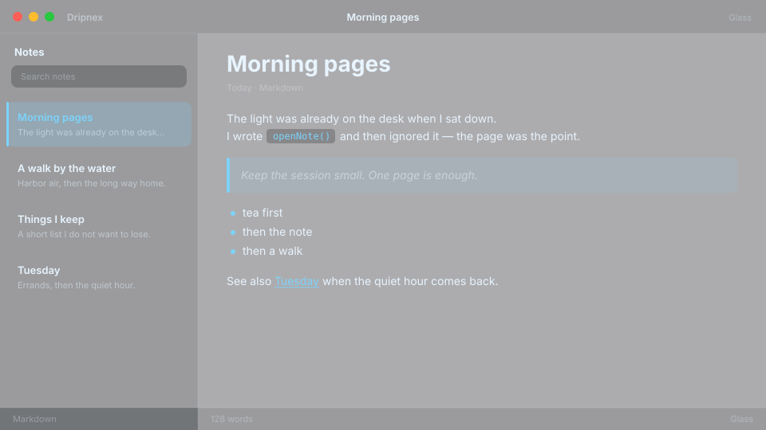

# Glass

Ice. The desktop shows through.



```
dripnex/theme-glass
```

## Palette

The chips live in [palette.html](palette.html) — open it in a browser. GitHub won’t paint HTML swatches here, so the hex list is below.

| Name | Token | Color | What it’s for |
| --- | --- | --- | --- |
| Base | `--bg-base` | `#080a10 · rgba(8, 10, 16, 0.18)` | Window background |
| Surface | `--bg-surface` | `#0e1018 · rgba(14, 16, 24, 0.28)` | Sidebar and chrome |
| Elevated | `--bg-elevated` | `#141822 · rgba(20, 24, 34, 0.36)` | Raised panels |
| Text | `--text-primary` | `#e8f4ff` | Headings and body |
| Muted | `--text-muted` | `#e8f4ff · rgba(232, 244, 255, 0.5)` | Secondary copy |
| Accent | `--accent` | `#7dd3fc` | Selection and links |
| Active | `--status-active` | `#7dd3fc` | Active status |
| Dropped | `--status-dropped` | `#fb7185` | Dropped status |

Pick it when you want the editor to feel like ice over your desktop.
